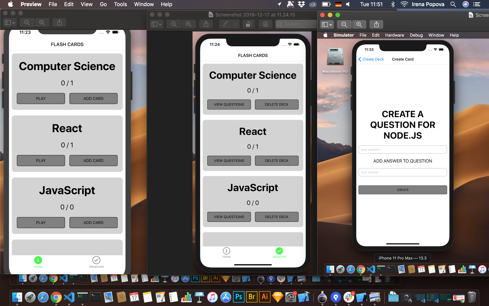

## Installation : 🚀 🍺

If you dont have a phone and emulator will be required google xcode or android studio
Use npm (so a newish version of node is required)

## How to open the project 🚀
# Clone the repo
1. open the folder in the code editor
2. type "npm install"
3. after it finishes type "npm start"

expo will start and you will be able to test the project localy
🍎
🔔
🐊
🌟

